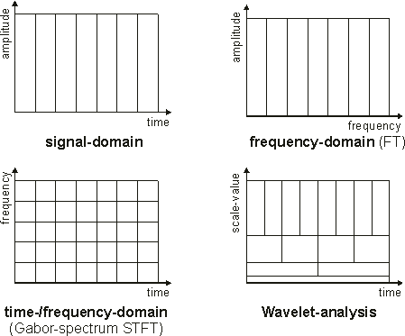

# Time-frequency plane sampling

Signal can be represented as a composition of sinusoid pulses in [time-frequency plane](https://en.wikipedia.org/wiki/Time%E2%80%93frequency_representation).

Decompositions:

- time domain - energy as a function of time
    - energy from all frequencies for each time bin
    - vertical stripes of TF plane
    - disjoint coverage
- frequency domain - energy as a function of frequency
    - energy from all time for each frequency bin
    - obtained from time domain by Fourier transform
    - horizontal stripes of TF plane
    - disjoint coverage
    - basis - sinusoids
- Short-time Fourier Transform (STFT)
    - time divided into frames and windowed
    - regular rectangular grid of samples in TF plane
    - width/height proportion depends on the window size
    - disjoint coverage
    - basis - sinusoid pulses
- Wavelet transform (WT)
    - irregular sampling of the TF plane - hyperbolic grid
    - longer time interval, shorter frequency interval for lower frequencies
    - shorter time interval, longer frequency interval for higher frequencies
    - intervals sizes are scaled by two
    - disjoint coverage
- Constant-Q transform (CQT)
    - frequency bands dependent on their central frequency (constant quotient)
    - frequencies sampled logarithmically
    - time sampler regularly, but the window size is not constant
    - not disjoint coverage
- Nonstationary Gabor Transform (NSGT)
    - ??? - needs studing the papers
    - not disjoint
- Reassigned STFT
    - allows to compute precise location of TF plane sampled
    - energy can be then requantized in an arbitrary way
    - still dependent on window size
    - possible to go multi-scale
- Sparse FT
    - ???
    - http://groups.csail.mit.edu/netmit/sFFT/
- other possible approaches to sampling the TF plane:
    - *stochastic sampling*
        - eg. using samples with blue-noise distribution
    - *adaptive sampling*
    - *iterative sampling*
- general TF plane transformations
    - [Fractional Fourier Transform](https://en.wikipedia.org/wiki/Fractional_Fourier_transform)
        - rotation
        - basis - chirps
    - [Linear canonical transformation](https://en.wikipedia.org/wiki/Linear_canonical_transformation)
        - linear transformation

image credit: http://dsp.stackexchange.com/questions/651/which-time-frequency-coefficients-does-the-wavelet-transform-compute

Desirable properties:

- good time and frequency localisation
- efficient computation
- efficient storage
- invertibility

## References

- [Time-Frequency and Time-Scale Methods: Adaptive Decompositions, Uncertainty Principles, and Sampling](http://www.math.nmsu.edu/~jlakey/book/title-pref-toc.pdf)
